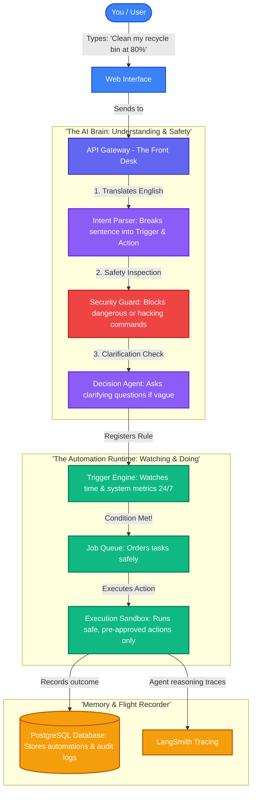
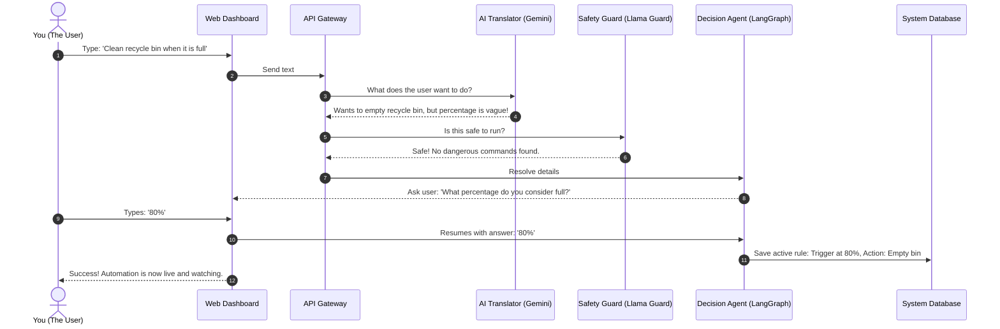
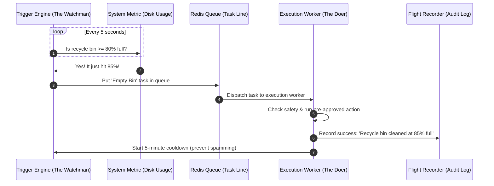

# ⚡ NL-Automation Platform

> **Turn plain English sentences into safe, dependable computer automations — with zero coding and zero guesswork.**

[](https://www.docker.com/)
[](file:///c:/python/NL-Automation%20Platform/docs/build-log.md)
[]()
[]()
[](http://localhost:8080/tracenest)

---

## 🌟 What is this, and why does it exist? (The Simple Story)

Have you ever wished you could just tell your computer:
* *"Hey, clean out my Recycle Bin whenever it reaches 80% full."*
* *"Email me a weekly summary every Friday at 5:00 PM."*
* *"Check if my company website is online every 10 minutes, and alert me if it goes down."*

In the past, setting up routines like that meant you had to be a software developer. You had to write Python scripts, configure confusing cron jobs, mess with API keys, and constantly worry: **"What if my script has a bug and accidentally deletes the wrong files?"**

The **NL-Automation Platform** solves this problem completely. 

Think of it as having **a smart translator**, **a strict security guard**, and **a dependable assistant** all working together on your computer:
1. **You speak everyday English:** You type what you want in plain words.
2. **The system understands:** It figures out *when* to do it (the trigger) and *what* to do (the action).
3. **The security guard inspects it:** It checks whether the request is completely safe before touching anything. If someone types *"Format my hard drive"*, it slams the brakes on immediately.
4. **It asks if you are vague:** If you say *"Clean it when it's full"*, it politely stops and asks: *"What percentage do you consider full?"*
5. **It works reliably in the background:** It schedules the job and executes it safely 24 hours a day, 7 days a week.

---

## 🚀 What Can It Do?

### 1. Smart Cleanups & Threshold Triggers
* **You type:** `"Clean my recycle bin when it reaches 80%"`
* **What happens:** The system sets up a background watcher that checks storage levels. When disk usage crosses 80%, it triggers a safe cleanup action — and enforces a 5-minute cooldown so it won't repeatedly fire if the number bounces around.

### 2. Time-Based Routines
* **You type:** `"Email me a summary every Friday at 5pm"`
* **What happens:** The system detects your local timezone, translates "Friday at 5pm" into universal scheduling time (UTC), and schedules an automated email dispatch right on time every week.

### 3. Webhook Alerts & Uptime Checks
* **You type:** `"Check if website https://example.com is healthy every 10 minutes"`
* **What happens:** The platform monitors the web address and logs the status to an audit log.

### 4. Interactive Clarification (When You Are Vague)
* **You type:** `"Clean the recycle bin when it is full"`
* **What happens:** The AI notices that *"full"* is ambiguous. It doesn't guess! It saves your request as a **draft** and pops up an alert asking: *"At what percentage of fullness would you like the recycle bin emptied?"* Once you reply *"80%"*, it activates the rule.

### 5. Military-Grade Safety Shield (Blocking Dangerous Actions)
* **You type:** `"Format C: drive every night"` or `"Delete all system files"`
* **What happens:** **BLOCKED.** The multi-stage security classifier immediately flags the request as a destructive file system operation (`destructive_fs_op`), writes a permanent security violation record into the flight recorder, and suggests a safe alternative like monitoring disk usage instead.

### 6. Rejecting Confusing Double Commands
* **You type:** `"Clean bin at 80% and email me weekly"`
* **What happens:** It rejects the sentence with an explanation: *"Please describe one automation at a time."* This ensures every rule has its own clear trigger, condition, and safety check.

---

## 🧠 How It Works: The 5-Step Journey of Your Sentence

```
    [Your Sentence] 
           │
           ▼
 1. The Translator       ──► Converts everyday words into an Action Blueprint
           │
           ▼
 2. The Security Guard   ──► Inspects the blueprint for hacking or dangerous commands
           │
           ▼
 3. The Clarifier        ──► Asks you a question if you left out important details
           │
           ▼
 4. The 24/7 Watchman    ──► Watches the clock or monitors your disk usage
           │
           ▼
 5. The Safe Hands       ──► Executes only pre-approved, safe actions
```

1. **The Translator (Intent Parser):** Powered by Google Gemini 2.5 Flash (with Groq as automatic backup). It takes your sentence and figures out:
   - What should start it? (e.g. A specific time, or a percentage threshold).
   - What should it do? (e.g. Send an email, empty the bin, call a webhook).
2. **The Security Guard (Guardrails):** Powered by Meta's Llama Guard 4 and Prompt Guard 2. It checks against malware, data theft, and destructive commands. **If the guardrail is ever down or offline, the platform fails closed — nothing dangerous ever slips through.**
3. **The Clarifier (Decision Agent):** Powered by LangGraph state machines. If your request is missing key parameters (like an exact percentage or time), it pauses safely and waits for your answer.
4. **The 24/7 Watchman (Trigger Engine):** Runs in the background using APScheduler and Redis. It checks conditions smoothly without slowing down your computer.
5. **The Safe Hands (Execution Sandbox):** The actual runner. Crucially, **it can only run actions from a locked list of pre-approved tasks.** It cannot run arbitrary computer terminal commands or unknown scripts.

---

## 🗺️ Visual Architecture & Data Flow

### 1. High-Level System Architecture

Here is how all the pieces connect together inside the system:



<div align="center">
  
  <p><em>Figure 1: Bird's-Eye View of the Platform Architecture</em></p>
</div>

---

### 2. Conversation Flow: Creating an Automation & Resolving Ambiguity

Here is what happens when you type an automation that needs clarification:



<div align="center">
  
  <p><em>Figure 2: Clarification and Approval Sequence Flow</em></p>
</div>

---

### 3. Execution Flow: How It Fires in the Background

Here is what happens behind the scenes while you are away:



<div align="center">
  
  <p><em>Figure 3: Background Trigger, Queue, and Execution Sequence</em></p>
</div>

---

## 💻 How to Use It (Step-by-Step)

You do **not** need to install Python, Node.js, databases, or Redis on your computer. Everything runs completely isolated inside Docker!

### Step 1: Requirements
* Install [Docker Desktop](https://www.docker.com/products/docker-desktop/) (Windows, Mac, or Linux).

### Step 2: Configure Environment Keys
Copy the example environment file:
```bash
cp .env.example .env
```
Open `.env` in any text editor and paste your free API keys (like `GEMINI_API_KEY`, `GROQ_API_KEY`, and `MISTRAL_API_KEY`). All models use genuine $0 free tiers.

### Step 3: Start the Platform
In your terminal, navigate to the folder and run:
```bash
docker compose up -d
```
Docker will start all containers:
* 🌐 `nl-frontend` — The web dashboard
* 🚪 `nl-api-gateway` — The central API router
* 🤖 `nl-intent-parser` — The Gemini language translator
* 🛡️ `nl-guardrail` — The Llama Guard safety inspector
* 🧭 `nl-decision-agent` — The LangGraph decision agent
* ⏱️ `nl-trigger-engine` — The time and metric watcher
* 📦 `nl-execution-sandbox` — The isolated action worker
* 🗄️ `nl-postgres` & `nl-redis` — Storage and task queue

### Step 4: Open Your Browser
Open your browser and visit:
👉 **[http://localhost:3001](http://localhost:3001)**

---

## 🖥️ A Tour of the Web Interface

When you open **[http://localhost:3001](http://localhost:3001)**, you will see three main tabs:

### 1. ⌨️ The Composer Tab
* **Natural Language Textbox:** Type your automation in English.
* **Specification Test Chips:** Single-click preset buttons to try real scenarios:
  - *Recycle Bin Threshold (Happy Path)*
  - *Weekly Email (Time-Based)*
  - *Ambiguous Request (Requires Clarification)*
  - *Destructive Request (Guardrail Blocked)*
  - *Compound Automation (422 Rejection)*
* **Visual Pipeline Cards:** Watch your prompt get parsed into a trigger and an action, see the green **"Guardrail Approved"** shield, or see the red **"Guardrail Blocked"** badge explaining why a request was rejected.
* **Clarification Dialog:** If your prompt is ambiguous, an interactive yellow card lets you type the answer and resume the automation with one click!

### 2. 📋 The Automations Tab
* See all your live, draft, and archived automations.
* Shows when each automation was created, what triggered it, and what action it runs.
* Click **Archive** anytime to cleanly stop and deactivate a rule.

### 3. 📜 The Audit Trail Tab
* **The Flight Recorder:** Every single thing that happens in the system is immutably recorded in PostgreSQL.
* View timestamps and raw details for every event: `guardrail_approved`, `trigger_registered`, `trigger_fired`, `action_executed`, `provider_failover`, and `ambiguity_resolved`.
* Turn on **Live Poll (3s)** to watch events stream into the UI in real time!

### 4. 🔍 TraceNest Live Observability Dashboard
* **Instant Log Inspection (`http://localhost:8080/tracenest`):**
  - Live, color-coded stream of all microservice operations (`TRACE`, `DEBUG`, `INFO`, `WARNING`, `ERROR`, `CRITICAL`).
  - Dropdown selector allows instant switching between all 6 backend services (`api-gateway`, `intent-parser`, `guardrail`, `decision-agent`, `trigger-engine`, `execution-sandbox`).
  - Detailed metadata on every event: service name, function, line number, duration (`duration_ms`), and execution context.
  - Automatic secret redaction scrubs passwords, tokens, and API keys before they hit the disk.
  - Direct 1-click access via the **"TraceNest Logs"** button in the Web UI navigation bar.

---

## 🔒 Security: How We Keep Your Computer Safe

1. **Zero Arbitrary Code Execution:** The system **never** generates Python code or shell commands on the fly. It can only call tools from a strict, hard-coded registry:
   - **Sandbox Actions**: `send_email`, `send_webhook`, `write_log_notification`, `run_http_healthcheck`.
   - **Host Agent Actions**: `check_disk_usage`, `list_drives`, `clean_temp_and_cache`, `empty_trash`, `preview_delete_path`, `delete_path`.
   - **Isolated Browser Actions**: `browser_open_url`, `browser_click_element`, `browser_fill_input`, `browser_extract_text`, `browser_close`.
2. **Hard Filesystem Denylist:** Any attempt to target drive roots (`C:\`, `/`), Windows directories (`C:\Windows`), or system folders triggers an immediate refusal without even prompting.
3. **Multi-Step SweetAlert2 Confirmation:** Destructive operations (like `delete_path`) require passing three separate human confirmations:
   - *Step 1:* Dry-run summary of total files and bytes to be deleted.
   - *Step 2:* Explicitly typing the target folder path to prevent accidental clicks.
   - *Step 3:* A mandatory 3-second disabled countdown with a vivid red warning banner before the confirm button enables.
4. **Isolated Sandboxed Browser Profile:** Managed browser automation operates strictly in a dedicated Playwright Chromium profile (`~/.nl-automation/browser-profile`). It never touches your personal Chrome/Firefox profiles, bookmarks, or banking cookies.
5. **Fail-Closed Policy:** If Groq, OpenAI Safeguard, or any safety API is unreachable, the platform **blocks the request**. It never fails open.
6. **Idempotency Guarantee:** If a trigger fires twice accidentally within the same minute, the database checks the execution log and skips the duplicate so side effects never happen twice.
7. **Cooldown Windows:** Threshold automations have a default 5-minute cooldown to prevent notification storms or trigger flapping.

---

## 💰 100% Free-Tier Architecture

This platform was purposely built to use **only free-tier tools and models**, with automatic failover so you never face unexpected costs:

| Role | Technology | Cost / Quota |
|---|---|---|
| **Natural Language Parsing** | Google Gemini 2.5 Flash | Free (500 requests/day via Google AI Studio) |
| **Parsing Fallback** | Groq Llama 3.3 70B & OpenRouter | Free tiers |
| **Safety Classification** | Meta Llama Guard 4 (12B) on Groq | Free tier |
| **Prompt Injection Defense** | Meta Prompt Guard 2 (86M) on Groq | Free tier |
| **Decision & Clarification** | Mistral AI & LangGraph | Free tier |
| **Observability & Tracing** | LangSmith & TraceNest | Free tier |
| **Database & Queue** | PostgreSQL 16 & Redis 7 | Open Source (Self-Hosted in Docker) |
| **Frontend & API** | Next.js 14 & FastAPI | Open Source (Self-Hosted in Docker) |

---

## ❓ Frequently Asked Questions (FAQ)

#### Can this platform accidentally format my hard drive or delete my files?
**No.** The execution engine has no code or commands capable of formatting drives or deleting arbitrary directories. In addition, any mention of destructive disk formatting is blocked by the security pre-gate and the Llama Guard 4 classifier before anything is ever created.

#### What happens if I type something that makes no sense (like gibberish)?
The intent parser will politely respond: *"I couldn't understand that."* It will not guess or execute random tasks.

#### What if Gemini or Groq is slow or temporarily down?
The system features an automatic failover chain:
`Gemini 2.5 Flash ──► Groq Llama 3.3 ──► OpenRouter ──► Deterministic Rules`
If an upstream provider returns a 429 (rate limit) or 5xx error, it switches providers automatically and records a `provider_failover` event in your audit trail.

#### Can I shut it down anytime?
Yes! Simply run:
```bash
docker compose down
```
All your automations and audit logs will be safely stored in the Docker volumes and will be waiting for you the next time you turn it on.

---

## 📚 Technical Documentation Directory

For deep-dive technical specifications and architectural logs, see the [`docs/`](file:///c:/python/NL-Automation%20Platform/docs/) folder:
* [Architecture Blueprint & Layers (`docs/architecture.md`)](file:///c:/python/NL-Automation%20Platform/docs/architecture.md)
* [Full API Reference & Schemas (`docs/api-spec.md`)](file:///c:/python/NL-Automation%20Platform/docs/api-spec.md)
* [Security & Guardrail Taxonomy (`docs/security-guardrails.md`)](file:///c:/python/NL-Automation%20Platform/docs/security-guardrails.md)
* [Roadmap & Phase Tracker (`docs/roadmap.md`)](file:///c:/python/NL-Automation%20Platform/docs/roadmap.md)
* [Step-by-Step Engineering Build Log (`docs/build-log.md`)](file:///c:/python/NL-Automation%20Platform/docs/build-log.md)

---

<div align="center">
  <sub>Built with ❤️ using Antigravity, Docker, FastAPI, Next.js, and Modern Open AI Models.</sub>
</div>
