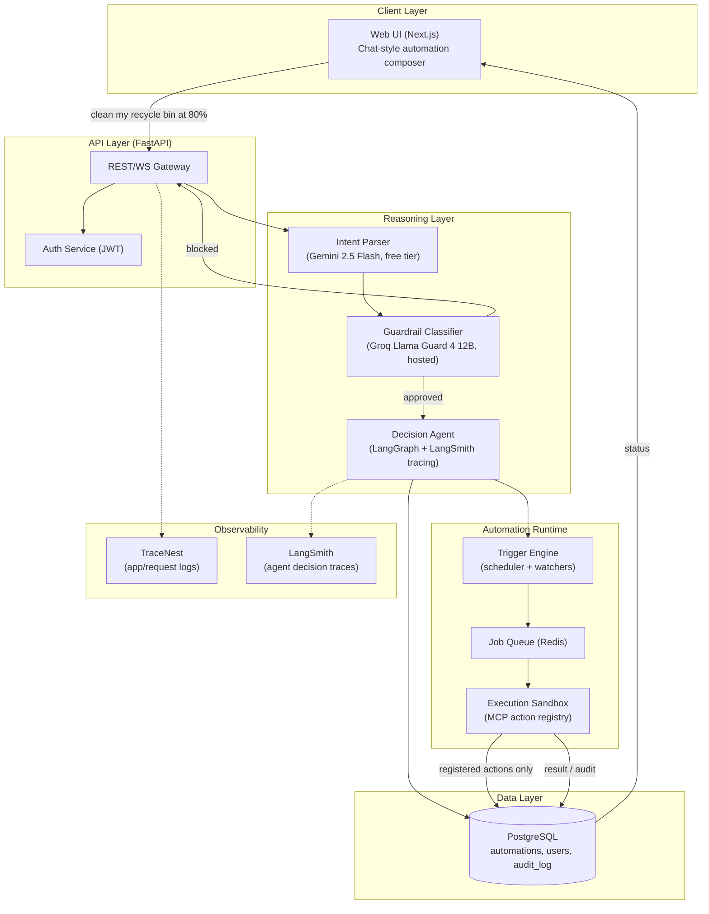
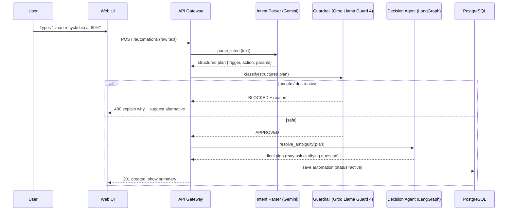
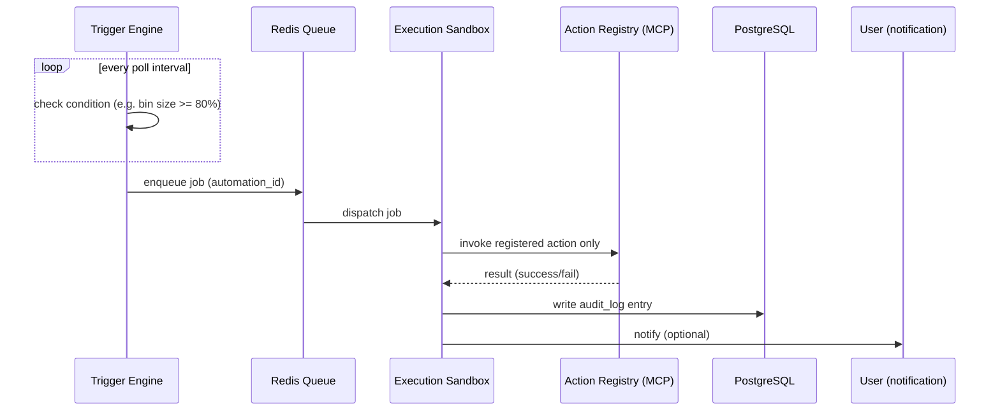

# Architecture Documentation

## Overview

The **NL-Automation Platform** compiles natural language user requests into safe, verified, and automated workflows. The platform operates under a zero-arbitrary-code execution policy, relying on a verified structured action registry and a multi-stage validation pipeline.

## Architectural Layers

1. **Client Layer (Next.js)**: Modern chat-style interface for natural language prompt submission, multi-step SweetAlert2 confirmation dialogues for destructive actions, and real-time execution monitoring.
2. **Gateway Layer (FastAPI)**: Central API and auth gateway validating requests, enforcing hard path denylists, and managing host agent tokens/jobs.
3. **Reasoning & Routing Layer**:
   - **Request Router** (`POST /route`): Fast-path classifier screening incoming raw text against default Llama Guard hazard taxonomies before intent parsing, sorting requests into `disallowed_content`, `informational_query`, or `automation`.
   - **Intent Parser** (Gemini 2.5 Flash / Groq / OpenRouter fallback): Deconstructs unstructured user input into a strongly typed `AutomationPlan`.
   - **Guardrail Classifier** (Groq Llama Guard 4 12B + Llama Prompt Guard 2 86M): Classifies intent against security, destructive actions, and prompt injections.
   - **Decision Agent** (LangGraph + Mistral): Coordinates ambiguity resolution, risk check branching, and 3-step destructive confirmation checkpoints, traced end-to-end with LangSmith.
4. **Automation Runtime**:
   - **Trigger Engine**: Evaluates schedules (APScheduler) and system/data states (polling watchers and host metrics).
   - **Queue (Redis)**: Buffers tasks with idempotency guarantees and dead-letter queues.
   - **Execution Sandbox**: Executes jobs strictly via a closed Model Context Protocol (MCP) action registry.
   - **Host Agent** (Standalone Python daemon): Runs on the user's OS to perform host-boundary actions (`empty_trash`, `check_disk_usage`, `list_drives`, `clean_temp_and_cache`, `delete_path`, and managed browser tasks).
5. **Data Layer (PostgreSQL)**: Persistent storage for users, automations, host agents, metrics, destructive action confirmation records, and immutable audit logs.
6. **Observability**:
   - **TraceNest**: Microservice request/response logging with automated secret redaction.
   - **LangSmith**: Agent reasoning and graph state transition tracing.

### Architectural Tradeoff Note: Managed Browser Isolation vs. Live Browser Access
Reaching into a user's live daily browser (with active sessions, banking cookies, saved credentials, and personal history) creates severe security, privacy, and trust liabilities. A compromised or over-eager automation could inadvertently perform irreversible actions within live authenticated sessions.

**Design Decision**: The host agent strictly operates a **separate, isolated managed browser session** (Playwright + Chromium running inside a dedicated temporary sandboxed profile). It possesses zero access to personal Chrome/Firefox profiles, saved logins, or personal cookies. This bounded scope provides robust web automation capabilities while preserving the user's personal security boundary.

---

## Diagrams

### 1. System Architecture

**mermaid.ink:** [Render Link](https://mermaid.ink/img/Zmxvd2NoYXJ0IFRCCiAgICBzdWJncmFwaCBDbGllbnRbIkNsaWVudCBMYXllciJdCiAgICAgICAgVUlbIldlYiBVSSAoTmV4dC5qcylcbkNoYXQtc3R5bGUgYXV0b21hdGlvbiBjb21wb3NlciJdCiAgICBlbmQKCiAgICBzdWJncmFwaCBHYXRld2F5WyJBUEkgTGF5ZXIgKEZhc3RBUEkpIl0KICAgICAgICBBUElbIlJFU1QvV1MgR2F0ZXdheSJdCiAgICAgICAgQVVUSFsiQXV0aCBTZXJ2aWNlIChKV1QpIl0KICAgIGVuZAoKICAgIHN1YmdyYXBoIEJyYWluWyJSZWFzb25pbmcgTGF5ZXIiXQogICAgICAgIFBBUlNFWyJJbnRlbnQgUGFyc2VyXG4oR2VtaW5pIDIuNSBGbGFzaCwgZnJlZSB0aWVyKSJdCiAgICAgICAgR1VBUkRbIkd1YXJkcmFpbCBDbGFzc2lmaWVyXG4oR3JvcSBMbGFtYSBHdWFyZCA0IDEyQiwgaG9zdGVkKSJdCiAgICAgICAgQUdFTlRbIkRlY2lzaW9uIEFnZW50XG4oTGFuZ0dyYXBoICsgTGFuZ1NtaXRoIHRyYWNpbmcpIl0KICAgIGVuZAoKICAgIHN1YmdyYXBoIFJ1bnRpbWVbIkF1dG9tYXRpb24gUnVudGltZSJdCiAgICAgICAgVFJJR0dFUlsiVHJpZ2dlciBFbmdpbmVcbihzY2hlZHVsZXIgKyB3YXRjaGVycykiXQogICAgICAgIFFVRVVFWyJKb2IgUXVldWUgKFJlZGlzKSJdCiAgICAgICAgRVhFQ1siRXhlY3V0aW9uIFNhbmRib3hcbihNQ1AgYWN0aW9uIHJlZ2lzdHJ5KSJdCiAgICBlbmQKCiAgICBzdWJncmFwaCBEYXRhWyJEYXRhIExheWVyIl0KICAgICAgICBQR1soIlBvc3RncmVTUUxcbmF1dG9tYXRpb25zLCB1c2VycywgYXVkaXRfbG9nIildCiAgICBlbmQKCiAgICBzdWJncmFwaCBPYnNbIk9ic2VydmFiaWxpdHkiXQogICAgICAgIFROWyJUcmFjZU5lc3RcbihhcHAvcmVxdWVzdCBsb2dzKSJdCiAgICAgICAgTFNbIkxhbmdTbWl0aFxuKGFnZW50IGRlY2lzaW9uIHRyYWNlcykiXQogICAgZW5kCgogICAgVUkgLS0-fCJjbGVhbiBteSByZWN5Y2xlIGJpbiBhdCA4MCUifCBBUEkKICAgIEFQSSAtLT4gQVVUSAogICAgQVBJIC0tPiBQQVJTRQogICAgUEFSU0UgLS0-IEdVQVJECiAgICBHVUFSRCAtLT58YmxvY2tlZHwgQVBJCiAgICBHVUFSRCAtLT58YXBwcm92ZWR8IEFHRU5UCiAgICBBR0VOVCAtLT4gUEcKICAgIEFHRU5UIC0tPiBUUklHR0VSCiAgICBUUklHR0VSIC0tPiBRVUVVRQogICAgUVVFVUUgLS0-IEVYRUMKICAgIEVYRUMgLS0-fHJlZ2lzdGVyZWQgYWN0aW9ucyBvbmx5fCBQRwogICAgRVhFQyAtLT58cmVzdWx0IC8gYXVkaXR8IFBHCiAgICBQRyAtLT58c3RhdHVzfCBVSQogICAgQVBJIC0uLT4gVE4KICAgIEFHRU5UIC0uLT4gTFMK)

---

### 2. Sequence — Creating an Automation

**mermaid.ink:** [Render Link](https://mermaid.ink/img/c2VxdWVuY2VEaWFncmFtCiAgICBwYXJ0aWNpcGFudCBVIGFzIFVzZXIKICAgIHBhcnRpY2lwYW50IFcgYXMgV2ViIFVJCiAgICBwYXJ0aWNpcGFudCBBIGFzIEFQSSBHYXRld2F5CiAgICBwYXJ0aWNpcGFudCBQIGFzIEludGVudCBQYXJzZXIgKExMTSkKICAgIHBhcnRpY2lwYW50IEcgYXMgR3VhcmRyYWlsIENsYXNzaWZpZXIKICAgIHBhcnRpY2lwYW50IEQgYXMgRGVjaXNpb24gQWdlbnQKICAgIHBhcnRpY2lwYW50IERCIGFzIFBvc3RncmVTUUwKCiAgICBVLT4-VzogVHlwZXMgImNsZWFuIHJlY3ljbGUgYmluIGF0IDgwJSIKICAgIFctPj5BOiBQT1NUIC9hdXRvbWF0aW9ucyAocmF3IHRleHQpCiAgICBBLT4-UDogcGFyc2VfaW50ZW50KHRleHQpCiAgICBQLS0-PkE6IHN0cnVjdHVyZWQgcGxhbiB7dHJpZ2dlciwgYWN0aW9uLCBwYXJhbXN9CiAgICBBLT4-RzogY2xhc3NpZnkoc3RydWN0dXJlZCBwbGFuKQogICAgYWx0IHVuc2FmZSAvIGRlc3RydWN0aXZlCiAgICAgICAgRy0tPj5BOiBCTE9DS0VEICsgcmVhc29uCiAgICAgICAgQS0tPj5XOiA0MDAgZXhwbGFpbiB3aHkgKyBzdWdnZXN0IGFsdGVybmF0aXZlCiAgICBlbHNlIHNhZmUKICAgICAgICBHLS0-PkE6IEFQUFJPVkVECiAgICAgICAgQS0-PkQ6IHJlc29sdmVfYW1iaWd1aXR5KHBsYW4pCiAgICAgICAgRC0tPj5BOiBmaW5hbCBwbGFuIChtYXkgYXNrIGNsYXJpZnlpbmcgcXVlc3Rpb24pCiAgICAgICAgQS0-PkRCOiBzYXZlIGF1dG9tYXRpb24gKHN0YXR1cz1hY3RpdmUpCiAgICAgICAgQS0tPj5XOiAyMDEgY3JlYXRlZCwgc2hvdyBzdW1tYXJ5CiAgICBlbmQK)

---

### 3. Sequence — Trigger Fires & Executes

**mermaid.ink:** [Render Link](https://mermaid.ink/img/c2VxdWVuY2VEaWFncmFtCiAgICBwYXJ0aWNpcGFudCBUIGFzIFRyaWdnZXIgRW5naW5lCiAgICBwYXJ0aWNpcGFudCBRIGFzIFJlZGlzIFF1ZXVlCiAgICBwYXJ0aWNpcGFudCBFIGFzIEV4ZWN1dGlvbiBTYW5kYm94CiAgICBwYXJ0aWNpcGFudCBSIGFzIEFjdGlvbiBSZWdpc3RyeSAoTUNQKQogICAgcGFydGljaXBhbnQgREIgYXMgUG9zdGdyZVNRTAogICAgcGFydGljaXBhbnQgVSBhcyBVc2VyIChub3RpZmljYXRpb24pCgogICAgbG9vcCBldmVyeSBwb2xsIGludGVydmFsCiAgICAgICAgVC0+PlQ6IGNoZWNrIGNvbmRpdGlvbiAoZS5nLiBiaW4gc2l6ZSA+PSA4MCUpCiAgICBlbmQKICAgIFQtPj5ROiBlbnF1ZXVlIGpvYiAoYXV0b21hdGlvbl9pZCkKICAgIFEtPj5FOiBkaXNwYXRjaCBqb2IKICAgIEUtPj5SOiBpbnZva2UgcmVnaXN0ZXJlZCBhY3Rpb24gb25seQogICAgUi0tPj5FOiByZXN1bHQgKHN1Y2Nlc3MvZmFpbCkKICAgIEUtPj5EQjogd3JpdGUgYXVkaXRfbG9nIGVudHJ5CiAgICBFLT4+VTogbm90aWZ5IChvcHRpb25hbCk=)
