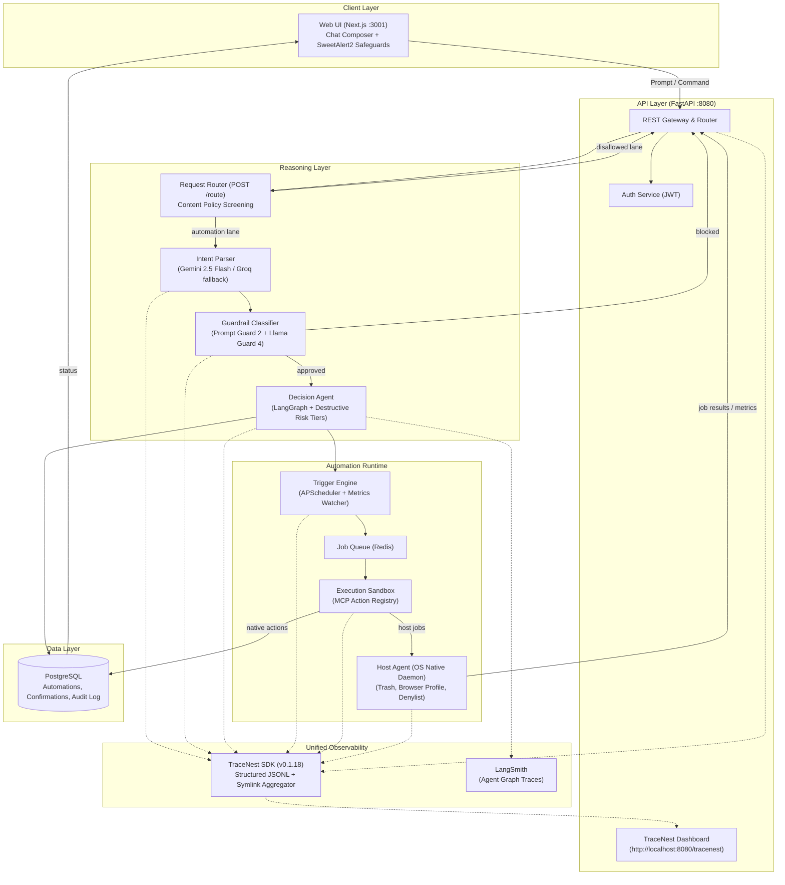
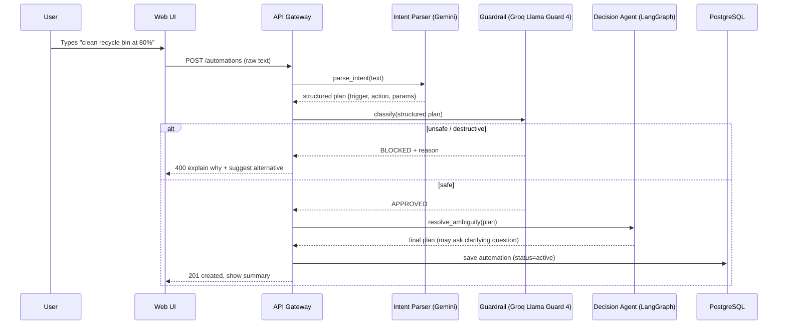
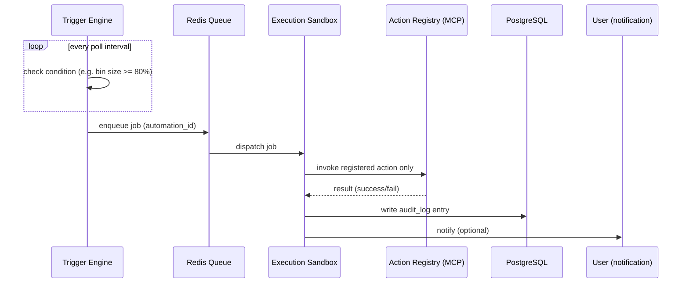

# Architecture Documentation

## Overview

The **NL-Automation Platform** compiles natural language user requests into safe, verified, and automated workflows. The platform operates under a zero-arbitrary-code execution policy, relying on a verified structured action registry and a multi-stage validation pipeline.

## Architectural Layers

1. **Client Layer (Next.js)**: Modern chat-style interface for natural language prompt submission, multi-step SweetAlert2 confirmation dialogues for destructive actions, and real-time execution monitoring.
2. **Gateway Layer (FastAPI)**: Central API and auth gateway validating requests, enforcing hard path denylists, and managing host agent tokens/jobs.
3. **Reasoning & Routing Layer**:
   - **Request Router** (`POST /route`): Fast-path classifier screening incoming raw text against default Llama Guard hazard taxonomies before intent parsing, sorting requests into `disallowed_content`, `informational_query`, or `automation`.
   - **Intent Parser** (Gemini 2.5 Flash / Groq / OpenRouter fallback): Deconstructs unstructured user input into a strongly typed `AutomationPlan`.
   - **Guardrail Classifier** (Groq Llama Guard 4 12B + Llama Prompt Guard 2 86M): Classifies intent against security, destructive actions, and prompt injections.
   - **Decision Agent** (LangGraph + Mistral): Coordinates ambiguity resolution, risk check branching, and 3-step destructive confirmation checkpoints, traced end-to-end with LangSmith.
4. **Automation Runtime**:
   - **Trigger Engine**: Evaluates schedules (APScheduler) and system/data states (polling watchers and host metrics).
   - **Queue (Redis)**: Buffers tasks with idempotency guarantees and dead-letter queues.
   - **Execution Sandbox**: Executes jobs strictly via a closed Model Context Protocol (MCP) action registry.
   - **Host Agent** (Standalone Python daemon): Runs on the user's OS to perform host-boundary actions (`empty_trash`, `check_disk_usage`, `list_drives`, `clean_temp_and_cache`, `delete_path`, and managed browser tasks).
5. **Data Layer (PostgreSQL)**: Persistent storage for users, automations, host agents, metrics, destructive action confirmation records, and immutable audit logs.
6. **Observability**:
   - **TraceNest**: Microservice request/response logging with automated secret redaction.
   - **LangSmith**: Agent reasoning and graph state transition tracing.

### Architectural Tradeoff Note: Managed Browser Isolation vs. Live Browser Access
Reaching into a user's live daily browser (with active sessions, banking cookies, saved credentials, and personal history) creates severe security, privacy, and trust liabilities. A compromised or over-eager automation could inadvertently perform irreversible actions within live authenticated sessions.

**Design Decision**: The host agent strictly operates a **separate, isolated managed browser session** (Playwright + Chromium running inside a dedicated temporary sandboxed profile). It possesses zero access to personal Chrome/Firefox profiles, saved logins, or personal cookies. This bounded scope provides robust web automation capabilities while preserving the user's personal security boundary.

---

## Diagrams

### 1. System Architecture

**mermaid.ink:** [Render Link](https://mermaid.ink/img/Zmxvd2NoYXJ0IFRCCiAgICBzdWJncmFwaCBDbGllbnRbIkNsaWVudCBMYXllciJdCiAgICAgICAgVUlbIldlYiBVSSAoTmV4dC5qcyA6MzAwMSlcbkNoYXQgQ29tcG9zZXIgKyBTd2VldEFsZXJ0MiBTYWZlZ3VhcmRzIl0KICAgIGVuZAoKICAgIHN1YmdyYXBoIEdhdGV3YXlbIkFQSSBMYXllciAoRmFzdEFQSSA6ODA4MCkiXQogICAgICAgIEFQSVsiUkVTVCBHYXRld2F5ICYgUm91dGVyIl0KICAgICAgICBBVVRIWyJBdXRoIFNlcnZpY2UgKEpXVCkiXQogICAgICAgIFROREFTSFsiVHJhY2VOZXN0IERhc2hib2FyZFxuKGh0dHA6Ly9sb2NhbGhvc3Q6ODA4MC90cmFjZW5lc3QpIl0KICAgIGVuZAoKICAgIHN1YmdyYXBoIEJyYWluWyJSZWFzb25pbmcgTGF5ZXIiXQogICAgICAgIFJPVVRFUlsiUmVxdWVzdCBSb3V0ZXIgKFBPU1QgL3JvdXRlKVxuQ29udGVudCBQb2xpY3kgU2NyZWVuaW5nIl0KICAgICAgICBQQVJTRVsiSW50ZW50IFBhcnNlclxuKEdlbWluaSAyLjUgRmxhc2ggLyBHcm9xIGZhbGxiYWNrKSJdCiAgICAgICAgR1VBUkRbIkd1YXJkcmFpbCBDbGFzc2lmaWVyXG4oUHJvbXB0IEd1YXJkIDIgKyBMbGFtYSBHdWFyZCA0KSJdCiAgICAgICAgQUdFTlRbIkRlY2lzaW9uIEFnZW50XG4oTGFuZ0dyYXBoICsgRGVzdHJ1Y3RpdmUgUmlzayBUaWVycykiXQogICAgZW5kCgogICAgc3ViZ3JhcGggUnVudGltZVsiQXV0b21hdGlvbiBSdW50aW1lIl0KICAgICAgICBUUklHR0VSWyJUcmlnZ2VyIEVuZ2luZVxuKEFQU2NoZWR1bGVyICsgTWV0cmljcyBXYXRjaGVyKSJdCiAgICAgICAgUVVFVUVbIkpvYiBRdWV1ZSAoUmVkaXMpIl0KICAgICAgICBFWEVDWyJFeGVjdXRpb24gU2FuZGJveFxuKE1DUCBBY3Rpb24gUmVnaXN0cnkpIl0KICAgICAgICBIT1NUWyJIb3N0IEFnZW50IChPUyBOYXRpdmUgRGFlbW9uKVxuKFRyYXNoLCBCcm93c2VyIFByb2ZpbGUsIERlbnlsaXN0KSJdCiAgICBlbmQKCiAgICBzdWJncmFwaCBEYXRhWyJEYXRhIExheWVyIl0KICAgICAgICBQR1soIlBvc3RncmVTUUxcbkF1dG9tYXRpb25zLCBDb25maXJtYXRpb25zLCBBdWRpdCBMb2ciKV0KICAgIGVuZAoKICAgIHN1YmdyYXBoIE9ic1siVW5pZmllZCBPYnNlcnZhYmlsaXR5Il0KICAgICAgICBUTlsiVHJhY2VOZXN0IFNESyAodjAuMS4xOClcblN0cnVjdHVyZWQgSlNPTkwgKyBTeW1saW5rIEFnZ3JlZ2F0b3IiXQogICAgICAgIExTWyJMYW5nU21pdGhcbihBZ2VudCBHcmFwaCBUcmFjZXMpIl0KICAgIGVuZAoKICAgIFVJIC0tPnwiUHJvbXB0IC8gQ29tbWFuZCJ8IEFQSQogICAgQVBJIC0tPiBBVVRICiAgICBBUEkgLS0+IFJPVVRFUgogICAgUk9VVEVSIC0tPnwiYXV0b21hdGlvbiBsYW5lInwgUEFSU0UKICAgIFJPVVRFUiAtLT58ImRpc2FsbG93ZWQgbGFuZSJ8IEFQSQogICAgUEFSU0UgLS0+IEdVQVJECiAgICBHVUFSRCAtLT58YmxvY2tlZHwgQVBJCiAgICBHVUFSRCAtLT58YXBwcm92ZWR8IEFHRU5UCiAgICBBR0VOVCAtLT4gUEcKICAgIEFHRU5UIC0tPiBUUklHR0VSCiAgICBUUklHR0VSIC0tPiBRVUVVRQogICAgUVVFVUUgLS0+IEVYRUMKICAgIEVYRUMgLS0+fGhvc3Qgam9ic3wgSE9TVAogICAgRVhFQyAtLT58bmF0aXZlIGFjdGlvbnN8IFBHCiAgICBIT1NUIC0tPnxqb2IgcmVzdWx0cyAvIG1ldHJpY3N8IEFQSQogICAgUEcgLS0+fHN0YXR1c3wgVUkKCiAgICAlJSBPYnNlcnZhYmlsaXR5IFN0cmVhbXMKICAgIEFQSSAtLi0+IFROCiAgICBQQVJTRSAtLi0+IFROCiAgICBHVUFSRCAtLi0+IFROCiAgICBBR0VOVCAtLi0+IFROCiAgICBUUklHR0VSIC0uLT4gVE4KICAgIEVYRUMgLS4tPiBUTgogICAgSE9TVCAtLi0+IFROCiAgICBUTiAtLi0+IFROREFTSAogICAgQUdFTlQgLS4tPiBMUwo=)

---

### 2. Sequence — Creating an Automation

**mermaid.ink:** [Render Link](https://mermaid.ink/img/c2VxdWVuY2VEaWFncmFtCiAgICBwYXJ0aWNpcGFudCBVIGFzIFVzZXIKICAgIHBhcnRpY2lwYW50IFcgYXMgV2ViIFVJCiAgICBwYXJ0aWNpcGFudCBBIGFzIEFQSSBHYXRld2F5CiAgICBwYXJ0aWNpcGFudCBQIGFzIEludGVudCBQYXJzZXIgKExMTSkKICAgIHBhcnRpY2lwYW50IEcgYXMgR3VhcmRyYWlsIENsYXNzaWZpZXIKICAgIHBhcnRpY2lwYW50IEQgYXMgRGVjaXNpb24gQWdlbnQKICAgIHBhcnRpY2lwYW50IERCIGFzIFBvc3RncmVTUUwKCiAgICBVLT4-VzogVHlwZXMgImNsZWFuIHJlY3ljbGUgYmluIGF0IDgwJSIKICAgIFctPj5BOiBQT1NUIC9hdXRvbWF0aW9ucyAocmF3IHRleHQpCiAgICBBLT4-UDogcGFyc2VfaW50ZW50KHRleHQpCiAgICBQLS0-PkE6IHN0cnVjdHVyZWQgcGxhbiB7dHJpZ2dlciwgYWN0aW9uLCBwYXJhbXN9CiAgICBBLT4-RzogY2xhc3NpZnkoc3RydWN0dXJlZCBwbGFuKQogICAgYWx0IHVuc2FmZSAvIGRlc3RydWN0aXZlCiAgICAgICAgRy0tPj5BOiBCTE9DS0VEICsgcmVhc29uCiAgICAgICAgQS0tPj5XOiA0MDAgZXhwbGFpbiB3aHkgKyBzdWdnZXN0IGFsdGVybmF0aXZlCiAgICBlbHNlIHNhZmUKICAgICAgICBHLS0-PkE6IEFQUFJPVkVECiAgICAgICAgQS0-PkQ6IHJlc29sdmVfYW1iaWd1aXR5KHBsYW4pCiAgICAgICAgRC0tPj5BOiBmaW5hbCBwbGFuIChtYXkgYXNrIGNsYXJpZnlpbmcgcXVlc3Rpb24pCiAgICAgICAgQS0-PkRCOiBzYXZlIGF1dG9tYXRpb24gKHN0YXR1cz1hY3RpdmUpCiAgICAgICAgQS0tPj5XOiAyMDEgY3JlYXRlZCwgc2hvdyBzdW1tYXJ5CiAgICBlbmQK)

---

### 3. Sequence — Trigger Fires & Executes

**mermaid.ink:** [Render Link](https://mermaid.ink/img/c2VxdWVuY2VEaWFncmFtCiAgICBwYXJ0aWNpcGFudCBUIGFzIFRyaWdnZXIgRW5naW5lCiAgICBwYXJ0aWNpcGFudCBRIGFzIFJlZGlzIFF1ZXVlCiAgICBwYXJ0aWNpcGFudCBFIGFzIEV4ZWN1dGlvbiBTYW5kYm94CiAgICBwYXJ0aWNpcGFudCBSIGFzIEFjdGlvbiBSZWdpc3RyeSAoTUNQKQogICAgcGFydGljaXBhbnQgREIgYXMgUG9zdGdyZVNRTAogICAgcGFydGljaXBhbnQgVSBhcyBVc2VyIChub3RpZmljYXRpb24pCgogICAgbG9vcCBldmVyeSBwb2xsIGludGVydmFsCiAgICAgICAgVC0+PlQ6IGNoZWNrIGNvbmRpdGlvbiAoZS5nLiBiaW4gc2l6ZSA+PSA4MCUpCiAgICBlbmQKICAgIFQtPj5ROiBlbnF1ZXVlIGpvYiAoYXV0b21hdGlvbl9pZCkKICAgIFEtPj5FOiBkaXNwYXRjaCBqb2IKICAgIEUtPj5SOiBpbnZva2UgcmVnaXN0ZXJlZCBhY3Rpb24gb25seQogICAgUi0tPj5FOiByZXN1bHQgKHN1Y2Nlc3MvZmFpbCkKICAgIEUtPj5EQjogd3JpdGUgYXVkaXRfbG9nIGVudHJ5CiAgICBFLT4+VTogbm90aWZ5IChvcHRpb25hbCk=)

---

## 4. Observability & Logging Architecture (TraceNest)

The platform embeds **TraceNest** (`tracenest>=0.1.18`) as its platform-wide unified logging and observability SDK across all microservices and FastAPI applications.

### Architecture Highlights:
1. **Centralized Web UI at `http://localhost:8080/tracenest`**:
   - The API Gateway mounts `tracenest.ui.router.router` directly at `/tracenest/` (with a friendly 307 redirect from `/tracenest`).
   - Clicking **"TraceNest Logs"** in the Next.js header navigates directly to the live dashboard.
2. **Multi-Service Log Aggregation**:
   - Service log directories (`intent-parser`, `guardrail`, `decision-agent`, `trigger-engine`, `execution-sandbox`) are mounted into the API Gateway container under `/app/TraceNestLogs_services/<service>/`.
   - A resilient daemon thread automatically symlinks individual daily logs into `/app/TraceNestLogs/{service}_{filename}`, allowing the TraceNest UI dropdown to seamlessly switch between all 6 microservices in real time.
3. **Comprehensive Log Level Support**:
   - Custom `TRACE` level (level 5) registered dynamically alongside `DEBUG`, `INFO`, `WARNING`, `ERROR`, and `CRITICAL`.
   - Dynamic enrichment includes service names, function names, source file line numbers, thread/process IDs, execution durations (`duration_ms`), and custom metadata dictionaries.
4. **Secret Redaction**:
   - TraceNest logs are strictly filtered via `shared/redaction.py` to strip API keys, Bearer tokens, passwords, and sensitive system parameters before persisting to disk.

---

### 5. Full End-to-End Decision, Safety & Observability Flow

```mermaid
flowchart TD
    START([User types a sentence]) --> ROUTER{"Request Router:\nLlama Guard DEFAULT taxonomy\non raw text"}

    %% ===== LANE 1: DISALLOWED CONTENT =====
    ROUTER -->|"illegal/harmful content\ne.g. buying real drugs"| REFUSE["Immediate refusal\nNO automation attempted\naudit: content_policy_blocked"]
    REFUSE --> END1([End])

    %% ===== LANE 2: INFORMATIONAL QUERY =====
    ROUTER -->|"one-off factual ask\ne.g. 'temp in Delhi today'"| WEBSEARCH["web_search action\nread-only, rate-limited"]
    WEBSEARCH --> SHOWRESULT["Return result to user\naudit logged"]
    SHOWRESULT --> END2([End])

    %% ===== LANE 3: AUTOMATION =====
    ROUTER -->|"'do X when Y' style request"| PARSE["Intent Parser\nGemini 2.5 Flash to Groq to OpenRouter\n(auto failover on rate-limit)"]

    PARSE --> PARSECHK{"Parseable?"}
    PARSECHK -->|"gibberish/empty"| UNPARSE["parseable:false\n'could not understand'"]
    UNPARSE --> END3([End])

    PARSECHK -->|"2+ automations\nin one sentence"| COMPOUND["HTTP 422\ncompound_automation_rejected"]
    COMPOUND --> END4([End])

    PARSECHK -->|"single valid plan"| REGCHK{"action.name in\nfixed registry?"}
    REGCHK -->|"No"| REJUNK["Rejected: unregistered action\nno fallback execution"]
    REJUNK --> END5([End])

    REGCHK -->|"Yes"| DENY{"Path resolves to a\ndrive root / system folder?\n(deterministic code check)"}
    DENY -->|"YES - forbidden"| HARDBLOCK["Hard refuse immediately\nNO confirmation offered, ever\nsuggest safe alternative"]
    HARDBLOCK --> END6([End])

    DENY -->|"No"| PGUARD["Llama Prompt Guard 2\npre-filter: injection/jailbreak?"]
    PGUARD --> PGCHK{"Flagged?"}
    PGCHK -->|"Yes"| BLOCKINJ["Blocked: prompt_injection"]
    BLOCKINJ --> END7([End])

    PGCHK -->|"No"| MGUARD["Llama Guard 4 12B\nCUSTOM taxonomy:\ndestructive_fs_op, credential_exfil,\nnetwork_exfil, malware_behavior"]
    MGUARD --> GCHK{"Guardrail result"}
    GCHK -->|"Groq unreachable"| FAILCLOSED["FAIL CLOSED\nblocked: guardrail_unavailable\n(never fails open)"]
    FAILCLOSED --> END8([End])
    GCHK -->|"Blocked"| BLOCKED["Blocked + reason + category\naudit: guardrail_blocked"]
    BLOCKED --> END9([End])

    GCHK -->|"Approved"| RISK{"Risk tier\n(fixed lookup, not LLM-decided)"}

    %% ===== RISK-BASED CONFIRMATION =====
    RISK -->|"medium/high\ne.g. delete_path, clean_temp"| DRYRUN["Dry-run preview:\nitem count, size, sample paths\n(nothing deleted yet)"]
    DRYRUN --> C1["SweetAlert #1:\npreview + Continue/Cancel"]
    C1 --> C2["SweetAlert #2:\ntype exact path to confirm"]
    C2 --> C3["SweetAlert #3:\n3s delay, final irreversible confirm"]
    C3 --> CCHK{"All 3 steps\nconfirmed?"}
    CCHK -->|"abandoned/timeout"| DRAFTEXP["Draft expires (24h)\nstatus: archived, nothing runs"]
    DRAFTEXP --> END10([End])
    CCHK -->|"confirmed"| AMBIG

    RISK -->|"low\ne.g. send_email, web_search"| AMBIG{"Ambiguous\nparameters?"}

    %% ===== DECISION AGENT (LangGraph) =====
    AMBIG -->|"Yes, e.g. 'when it's full'"| ASKUSER["LangGraph interrupt:\nask clarifying question"]
    ASKUSER --> WAITUSER["Pause, wait for user's answer\n(checkpointed, survives restart)"]
    WAITUSER --> RESOLVE["Resolve plan field\nwith user's answer"]
    RESOLVE --> AMBIG

    AMBIG -->|"No"| FINALIZE["Finalize trigger config"]
    FINALIZE -.->|"full node-by-node trace"| LANGSMITH[("LangSmith\nagent decision tracing")]

    FINALIZE --> IMMCHK{"Immediate command\nor recurring automation?"}
    IMMCHK -->|"immediate, run once"| DIRECT["Dispatch directly to\nExecution Sandbox"]
    IMMCHK -->|"recurring"| PERSIST["Persist automation\nstatus=active in PostgreSQL"]

    %% ===== TRIGGER ENGINE =====
    PERSIST --> REGTRIG["Register with Trigger Engine"]
    REGTRIG --> TTYPE{"Trigger type?"}
    TTYPE -->|"time"| SCHED["APScheduler job\n(UTC-converted, user timezone stored)"]
    TTYPE -->|"threshold"| WATCH["Threshold watcher\npolls every N sec"]

    WATCH --> MSRC{"Fresh host-agent\nmetric available?"}
    MSRC -->|"Yes"| REALM["Use real pushed metric\n(metric_source=host_agent)"]
    MSRC -->|"No"| MOCKM["Use mock/demo endpoint\n(metric_source=mock_fallback)"]
    REALM --> TCHK{"Condition met?"}
    MOCKM --> TCHK
    TCHK -->|"No"| WATCH
    TCHK -->|"Yes"| CDCHK{"Inside cooldown\nwindow?"}
    CDCHK -->|"Yes, suppress"| WATCH
    CDCHK -->|"No"| ENQ["Enqueue job to Redis"]
    SCHED -->|"fires at scheduled time"| ENQ

    %% ===== EXECUTION =====
    ENQ --> QUEUE[("Redis Queue")]
    DIRECT --> QUEUE
    QUEUE --> DISPATCH["Execution Sandbox\nconsumes job"]
    DISPATCH --> IDEM{"Already executed\nthis trigger_window?"}
    IDEM -->|"Yes"| SKIPDUP["Skip, return prior result\n(idempotency guarantee)"]
    SKIPDUP --> AUDIT

    IDEM -->|"No"| HOSTCHK{"Needs host machine?\ne.g. empty_trash, delete_path,\ncheck_disk_usage"}
    HOSTCHK -->|"Yes"| HOSTJOB["Write to host_agent_jobs\n(host-agent polls, not pushed to)"]
    HOSTJOB --> HRES{"Result received\nwithin timeout?"}
    HRES -->|"No"| DEADLTR["3 retries, then\ndead-letter queue"]
    DEADLTR --> AUDIT
    HRES -->|"Yes"| REC["Record execution result"]

    HOSTCHK -->|"No, container-native"| RUNACT["Invoke registered action\n(fixed action registry only)"]
    RUNACT --> REC

    REC --> AUDIT[("PostgreSQL\naudit_log + execution_log\nimmutable record")]
    AUDIT --> NOTIFY["Update UI status,\nnotify user"]
    NOTIFY --> ENDALL([Done])

    %% ===== OBSERVABILITY & LOGGING ARCHITECTURE =====
    subgraph Observability["Unified Tri-Pillar Observability Architecture"]
        direction TB

        subgraph TN_Pipeline["TraceNest Real-Time Platform Logging SDK (v0.1.18)"]
            direction TB
            HANDLER["TraceNestLoggingHandler\n(Stdlib logging bridge)"]
            REDACT["Secret Redaction Filter\n(shared/redaction.py regex scrub)"]
            LEVELS["Dynamic Log Levels\nTRACE(5), DEBUG, INFO, WARN, ERROR, CRITICAL\n+ duration_ms, line, func, trace_id"]
            
            HANDLER --> REDACT
            REDACT --> LEVELS

            subgraph Aggregation["Multi-Service Log Volume Aggregation"]
                LOGS_LOCAL["Container Local JSONL Logs\n(/app/TraceNestLogs/YYYY-MM-DD.log)"]
                VOL_MOUNTS["Docker Volume Mounts\n(/app/TraceNestLogs_services/<service>/)"]
                DAEMON["API Gateway Symlink Aggregator\n(Auto-links service_YYYY-MM-DD.log)"]
                
                LOGS_LOCAL --> VOL_MOUNTS
                VOL_MOUNTS --> DAEMON
            end

            LEVELS --> LOGS_LOCAL

            subgraph TN_UI["TraceNest Observability Dashboard"]
                TNDASH["Web UI Dashboard\nhttp://localhost:8080/tracenest\n(307 redirect to /tracenest/)"]
                TNDROP["Dynamic Multi-Service Log Dropdown\n(api-gateway, intent-parser, guardrail,\ndecision-agent, trigger-engine, execution-sandbox)"]
                NAVLINK["Frontend Web UI Navbar Link\n('TraceNest Logs' Button)"]
                
                DAEMON --> TNDASH
                TNDASH --> TNDROP
                NAVLINK -.->|"1-click access"| TNDASH
            end
        end

        subgraph LangSmithTracing["LangSmith Agent Tracing"]
            LSTRACE[("LangSmith Tracing\nLLM reasoning, token counts,\ngraph state checkpoints")]
        end

        subgraph BusinessAudit["PostgreSQL Flight Recorder"]
            PGAUDIT[("PostgreSQL\naudit_log + execution_log\nimmutable business events")]
        end
    end

    %% Service Logging Streams to TraceNest
    ROUTER -.->|"TRACE / DEBUG / INFO"| HANDLER
    PARSE -.->|"provider failover & tokens"| HANDLER
    MGUARD -.->|"guardrail classification"| HANDLER
    FINALIZE -.->|"decision events"| HANDLER
    FINALIZE -.->|"reasoning traces"| LSTRACE
    WATCH -.->|"metric evaluations & cooldown"| HANDLER
    DISPATCH -.->|"sandbox action execution"| HANDLER
    HOSTJOB -.->|"host agent operations"| HANDLER
    REC -.->|"immutable audit record"| PGAUDIT
```

**mermaid.ink:** [Render Link](https://mermaid.ink/img/Zmxvd2NoYXJ0IFRECgogICAgU1RBUlQoW1VzZXIgdHlwZXMgYSBzZW50ZW5jZV0pIC0tPiBST1VURVJ7IlJlcXVlc3QgUm91dGVyOlxuTGxhbWEgR3VhcmQgREVGQVVMVCB0YXhvbm9teVxub24gcmF3IHRleHQifQoKICAgICUlID09PT09IExBTkUgMTogRElTQUxMT1dFRCBDT05URU5UID09PT09CiAgICBST1VURVIgLS0-fCJpbGxlZ2FsL2hhcm1mdWwgY29udGVudFxuZS5nLiBidXlpbmcgcmVhbCBkcnVncyJ8IFJFRlVTRSsiSW1tZWRpYXRlIHJlZnVzYWxcbk5PIGF1dG9tYXRpb24gYXR0ZW1wdGVkXG5hdWRpdDogY29udGVudF9wb2xpY3lfYmxvY2tlZCJdCiAgICBSRUZVU0UgLS0-IEVORDEoW0VuZF0pCgogICAgJSUgPT09PT0gTEFORSAyOiBJTkZPUk1BVElPTkFMIFFVRVJZID09PT09CiAgICBST1VURVIgLS0-fCJvbmUtb2ZmIGZhY3R1YWwgYXNrXG5lLmcuICd0ZW1wIGluIERlbGhpIHRvZGF5JyJ8IFdFQlNFQVJDSFsid2ViX3NlYXJjaCBhY3Rpb25cbnJlYWQtb25seSwgcmF0ZS1saW1pdGVkIl0KICAgIFdFQlNFQVJDSCAtLT4gU0hPV1JFU1VMVFsicmV0dXJuIHJlc3VsdCB0byB1c2VyXG5hdWRpdCBsb2dnZWQiXQogICAgU0hPV1JFU1VMVCAtLT4gRU5EMihbRW5kXSkKCgogICAgJSUgPT09PT0gTEFORSAzOiBBVVRPTUFUSU9OID09PT09CiAgICBST1VURVIgLS0-fCInZG8gWCB3aGVuIFknIHN0eWxlIHJlcXVlc3QifCBQQVJTRVsiSW50ZW50IFBhcnNlclxuR2VtaW5pIDIuNSBGbGFzaCB0byBHcm9xIHRvIE9wZW5Sb3V0ZXJcbihhdXRvIGZhaWxvdmVyIG9uIHJhdGUtbGltaXQpIl0KCgogICAgUEFSU0UgLS0-IFBBUlNFQ0hLeyJQYXJzZWFibGU/In0KICAgIFBBUlNFQ0hLIC0tPnwiZ2liYmVyaXNoL2VtcHR5InwgVU5QQVJTRVsicGFyc2VhYmxlOmZhbHNlXG4nY291bGQgbm90IHVuZGVyc3RhbmQnIl0KICAgIFVOUEFSU0UgLS0-IEVORDMoW0VuZF0pCgogICAgUEFSU0VDS0sgLS0-fCIyKyBhdXRvbWF0aW9uc1xuaW4gb25lIHNlbnRlbmNlInwgQ09NUE9VTkRbIkhUVFAgNDIyXG5jb21wb3VuZF9hdXRvbWF0aW9uX3JlamVjdGVkIl0KICAgIENPTVBPVU5EIC0tPiBFTkQ0KFtFbmRdKQoKICAgIFBBUlNFQ0hLIC0tPnwic2luZ2xlIHZhbGlkIHBsYW4ifSBSRUdDSEt7ImFjdGlvbi5uYW1lIGluXG5maXhlZCByZWdpc3RyeT8ifQogICAgUkVHQ0hLIC0tPnwiTm8ifSBSRUpVTktbIlJlamVjdGVkOiB1bnJlZ2lzdGVyZWQgYWN0aW9uXG5ubyBmYWxsYmFjayBleGVjdXRpb24iXQogICAgUkVKVU5LIC0tPiBFTkQ1KFtFbmRdKQoKICAgIFJFR0NISyAtLT58IlllcyJ8IERFTll7IlBhdGggcmVzb2x2ZXMgdG8gYVxuZHJpdmUgcm9vdCAvIHN5c3RlbSBmb2xkZXI/XG4oZGV0ZXJtaW5pc3RpYyBjb2RlIGNoZWNrKSJ9CiAgICBERU5ZIC0tPnwiWUVTIC0gZm9yYmlkZGVuInwgSEFSREJMT0NLIkltdW1tZWRpYXRlIGhhcmQgcmVmdXNhbFxuTk8gY29uZmlybWF0aW9uIG9mZmVyZWQsIGV2ZXJcbnN1Z2dlc3Qgc2FmZSBhbHRlcm5hdGl2ZSJdCiAgICBIQVJEQkxPQ0sgLS0-IEVORDYoW0VuZF0pCgogICAgREVOWSAtLT58Ik5vInwgUEdVQVJFWyJMbGFtYSBQcm9tcHQgR3VhcmQgMlxucHJlLWZpbHRlcjogaW5qZWN0aW9uL2phaWxicmVhaz8iXQogICAgUEdVQVJEIC0tPiBQR0NIS3siRmxhZ2dlZD8ifQogICAgUEdDSEsgLS0-fCJZZXMifSBCTE9DS0lOSlsicHJvbXB0X2luamVjdGlvbiJdCiAgICBCTE9DS0lOSiAtLT4gRU5ENyhbRW5kXSkKCgogICAgUEdDSEsgLS0-fCJObyJ8IE1HVUFSRFsicHJvbXB0X2d1YXJkX3NhZmUiXQ==)
