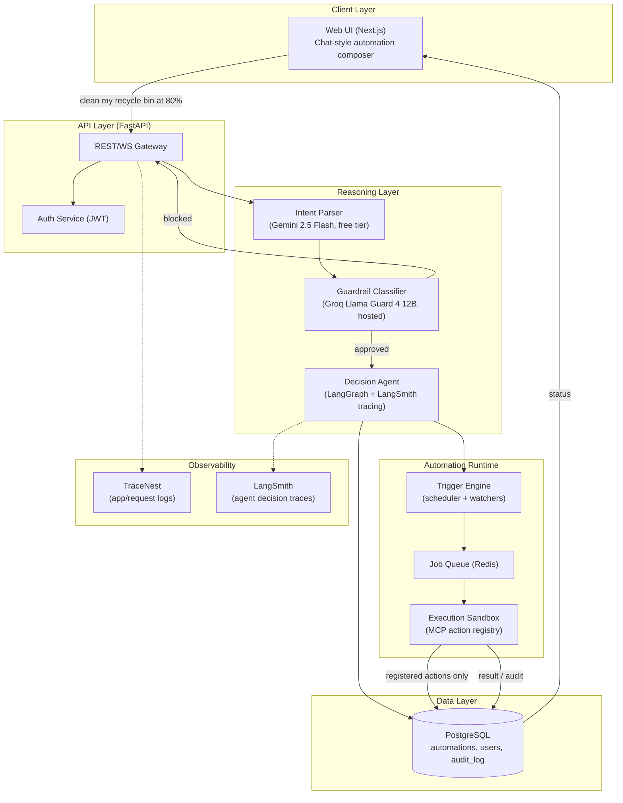
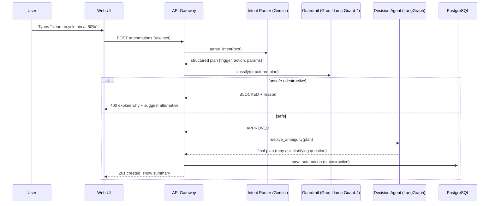
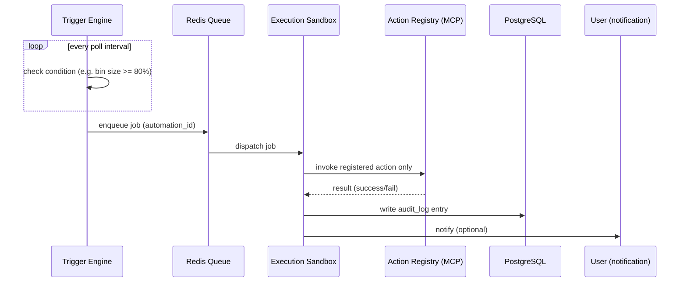

# NL-Automation Platform — Full Build Specification (Antigravity Execution Prompt)

## READ THIS FIRST — Rules for Antigravity

1. **This document is the entire plan.** Do not generate your own project plan, architecture proposal, or roadmap. Do not "improve" the scope. If something is ambiguous, flag it in `docs/build-log.md` and use the most conservative interpretation — do not silently decide on your own.
2. **Execute phase by phase, in order.** Finish a phase, run its acceptance checklist, write the result into `docs/build-log.md`, then stop and wait for the next phase to be pasted. Do not jump ahead.
3. **Do not substitute tools/models/services listed below.** If a listed free-tier limit is hit during development, fail loudly and log it — do not silently swap in a different (possibly paid) model.
4. **Everything runs in Docker. Nothing runs on the host** except Docker itself and, where explicitly called out (Recycle Bin host-agent), one documented exception.
5. **Every action the system can take must be in the fixed action registry.** No dynamically generated/executed code, ever, under any phase.
6. **All API keys are read from environment variables only**, never hardcoded, never logged in plaintext (see Logging section — redact secrets before they hit any log sink).

---

## Project Overview

Build a self-hosted platform where a user types a plain-English sentence describing an automation (e.g. "clean my Recycle Bin when it reaches 80%", "email me a summary every Friday at 5pm", "notify me if disk usage goes over 90%") and the system:

1. Parses it into a structured automation plan (trigger + condition + action).
2. Runs the plan past a safety classifier that blocks destructive/malicious intents *before* anything is saved or scheduled.
3. Uses a decision layer to resolve ambiguity (ask a clarifying question if underspecified) and pick the right trigger mechanism.
4. Registers the automation in a scheduler/watcher runtime that executes it through a fixed, declared action registry only.
5. Logs every decision and execution to an audit trail and to full agent-trace observability.

This is a general-purpose NL→automation compiler — the recycle-bin example is a demo fixture, not the whole product.

*(Context: this concept originated from an interviewer's prompt to think through how such a system would work — the spec below is the real engineering answer to that prompt, not just a sketch.)*

---

## Should this be Dockerized?

Yes. Multiple independent services need to run together reliably (API, Postgres, Redis, trigger engine), and the execution sandbox is a security boundary, not a convenience — containerizing it means a bad or over-broad action can't reach the host by default. One documented exception: the Recycle Bin example is a Windows host-OS action a Linux container can't natively see. MVP ships with container-reachable actions only (email, webhooks, HTTP health checks, file-watch on a mounted volume); a thin host-side watcher for OS-level actions is an explicit, separately-approved v2 add-on — never silently added.

---

## FREE-ONLY Model & Provider Mapping

No premium/paid-tier models anywhere in the default path. Every provider below is used strictly within its free tier. Build the `LLMProvider` interface (Phase 2) so any of these can be swapped without touching business logic.

| Role | Primary | Fallback(s) | Why |
|---|---|---|---|
| Intent Parser (NL → structured plan) | **Gemini 2.5 Flash** (Google AI Studio, `GEMINI_API_KEY`) — 500 req/day free, strong structured-output/function-calling | **Groq `llama-3.3-70b-versatile`** (`GROQ_API_KEY`, free tier, very fast) → **OpenRouter free models** e.g. `deepseek/deepseek-chat:free`, `meta-llama/llama-3.3-70b-instruct:free` (`OPENROUTER_API_KEY`) | Gemini free tier is currently the most generous for daily volume; Groq/OpenRouter as automatic failover if quota is hit |
| Guardrail Classifier (safety) | **Groq-hosted `meta-llama/llama-guard-4-12b`** (`GROQ_API_KEY`) | **Groq `meta-llama/llama-prompt-guard-2-86m`** as a fast pre-filter for prompt-injection before the main guard call | Purpose-built safety classifiers, hosted, free-tier — no self-hosted Ollama/GPU container needed. This is the "latest, not generic" choice: don't reinvent safety by prompting a general chat model |
| Decision Agent (ambiguity resolution, LangGraph nodes) | **Mistral free tier** (`MISTRAL_API_KEY`) | Gemini 2.5 Flash (shared with Intent Parser pool, separate quota tracking) | Keep decision-layer calls on a distinct provider so Intent Parser rate limits don't starve the agent mid-flow |
| Agent tracing/observability | **LangSmith** (`LANGSMITH_API_KEY` — you already have one) | — | Standard observability layer for LangGraph in 2026; free tier trace volume is enough for dev/interview-demo scale |
| App/request logging | **TraceNest** (`pip install tracenest`) as FastAPI middleware in every service | Python stdlib `logging` as a hard fallback if TraceNest itself errors | Zero-config, Docker-safe, built-in log viewer UI, native FastAPI middleware |
| Held in reserve, not wired into the default path | HuggingFace Inference (`HUGGINGFACE_API_KEY`) — small embedding/classification models if needed later; NVIDIA NIM (`NVIDIA_API_KEY`) — free credits, backup high-throughput slot; Kimi/Moonshot (`KIMI_API_KEY`) — large-context backup | | Don't wire these in Phase 0–7 unless a specific need arises — keep the default path lean and documented |
| **Do not use by default** | OpenAI key, DeepSeek-via-wavespeed key | | OpenAI's free tier is effectively nonexistent (billed), and wavespeed.ai is a paid inference host, not a genuinely free tier — using either would violate the "free" requirement unless you've separately confirmed real free credit remains |
| **Not applicable to this project** | Stitch API key | | Stitch is a UI-mockup/design generation tool, unrelated to an LLM backend — don't wire it in |

Each provider's key goes in `.env` under its own name; `.env.example` lists every variable name with no values. The `LLMProvider` interface must implement automatic failover down the fallback chain on rate-limit or 5xx errors, and log every failover event.

---

## Logging & Observability (explicit requirement — do not skip)

Two layers, both mandatory:

1. **Application/request logging — TraceNest.**
   - `pip install tracenest` in every Python service.
   - `from tracenest.fastapi import TraceNestMiddleware` added to each FastAPI app.
   - Logs every incoming request, response status, duration, and unhandled exception, to `TraceNestLogs/` inside each service container (mount as a named Docker volume per service so logs survive restarts).
   - **Redact secrets:** wrap any log call touching request/response bodies with a redaction helper that strips known key patterns (Authorization headers, anything matching `sk-`, `gsk_`, `AQ.`, etc.) before it's written.
   - TraceNest's built-in UI (`/tracenest` route) exposed only inside the Docker network, not to host, unless explicitly port-mapped for local debugging.

2. **Agent/decision tracing — LangSmith.**
   - Every LangGraph run wrapped with LangSmith tracing enabled (`LANGSMITH_TRACING=true`, `LANGSMITH_API_KEY`, `LANGSMITH_PROJECT=nl-automation-platform`).
   - This is what actually answers "why did the agent decide X" — the audit_log table in Postgres records the *outcome*, LangSmith records the *reasoning trace*. Both are needed; they are not redundant.

3. **Audit trail (business-level, in Postgres — separate from both of the above).**
   - `audit_log` table: every guardrail decision (approved/blocked + reason), every trigger fire, every action execution result. This is what the end user sees in the UI ("last run", "why was this blocked").

---

## Edge Cases — must be explicitly handled, not left implicit

| Case | Required behavior |
|---|---|
| Empty / gibberish input | Intent Parser returns a structured "unparseable" result, not a guess. UI shows "I couldn't understand that." |
| One sentence describing multiple automations ("clean bin at 80% and email me weekly") | Parser must either split into multiple plans with explicit confirmation, or reject with "please describe one automation at a time" — pick one behavior and document it in `docs/security-guardrails.md`; do not silently pick only the first clause |
| Duplicate/conflicting automation (same trigger+action already active) | Detected at save time, user is warned, not silently duplicated |
| Plan references an action not in the registry | Hard rejection with a clear message — never a silent no-op |
| LLM provider rate-limited or down | Automatic failover per the provider table above; if *all* providers in a role's chain are down, the request fails closed with a clear error, never proceeds with a guess |
| Guardrail classifier itself unavailable | **Fail closed** — block the automation, do not allow it through. This is non-negotiable; a security check must never fail open |
| Malformed/invalid JSON from the LLM structured-output call | Schema validation via Pydantic; on failure, one automatic corrective retry with the validation error fed back to the model; cap at 2 retries, then fail closed with a logged reason |
| Threshold condition flapping (true/false/true rapidly) | Debounce/cooldown window per automation (configurable, default e.g. 5 min) before it can re-fire |
| Duplicate trigger fire before the previous execution acknowledges | Idempotency key per (automation_id, trigger_window) so the same physical event can't double-execute |
| Timezone handling for time-based triggers | Store trigger times in UTC + explicit user timezone; never assume server-local time |
| Stuck/long-running job in the execution queue | Timeout per job type + dead-letter queue in Redis, visible in the audit log |
| User edits or deletes an automation mid-execution | In-flight execution completes or times out per its own contract; the edit/delete only affects future runs, and this is documented behavior, not a race condition left to chance |
| Ambiguity clarification the user never answers | Automation stays in `draft` status with an expiry (e.g. 24h), then is auto-archived — never silently promoted to `active` with a guessed answer |
| Any provider API key exhausted mid-session | Logged as a failover event (see Logging section), user-facing behavior degrades gracefully to "reduced availability," never a hard crash |

---

## Architecture Diagrams

### 1. System Architecture



### 2. Sequence — Creating an Automation



### 3. Sequence — Trigger Fires & Executes



---

## Tech Stack (locked — do not substitute)

| Layer | Choice |
|---|---|
| Backend API | FastAPI (Python) |
| Intent parsing | Gemini 2.5 Flash → Groq → OpenRouter free models (see mapping table) |
| Guardrail | Groq Llama Guard 4 12B + Llama Prompt Guard 2 86M (hosted, free tier) |
| Agent/decision layer | LangGraph, traced via LangSmith |
| Action execution | MCP server, fixed action registry |
| Trigger/scheduling | APScheduler (time) + Redis-backed polling watcher (threshold) |
| Queue | Redis |
| Database | PostgreSQL |
| App logging | TraceNest |
| Frontend | Next.js (TypeScript) |
| Diagrams | Mermaid source, rendered via mermaid.ink only |

---

## Repository / Folder Structure

```
nl-automation-platform/
├── docker-compose.yml
├── .env.example
├── docs/
│   ├── spec.md                  # this file, kept in sync, source of truth
│   ├── architecture.md          # narrative + embeds the 3 diagrams
│   ├── api-spec.md              # OpenAPI-derived, human-readable
│   ├── security-guardrails.md   # blocked-action taxonomy + edge-case decisions
│   ├── setup.md                 # docker compose up, .env, first run
│   ├── roadmap.md               # phase tracker, done/pending
│   ├── build-log.md             # step-by-step narrative log, updated every phase
│   └── diagrams/
│       ├── architecture.mmd
│       ├── sequence-create.mmd
│       └── sequence-trigger.mmd
├── services/
│   ├── api-gateway/
│   ├── intent-parser/
│   ├── guardrail/
│   ├── decision-agent/
│   ├── trigger-engine/
│   └── execution-sandbox/
│       └── app/actions/         # one file per registered action, explicit allowlist
├── frontend/
└── shared/
    └── schemas/                 # Pydantic models shared across services
```

---

## Build Phases (paste one at a time into Antigravity)

### Phase 0 — Scaffolding
- Create the repo structure above.
- `docker-compose.yml`: postgres, redis, api-gateway, intent-parser, guardrail, decision-agent, trigger-engine, execution-sandbox, frontend. One internal network; only api-gateway and frontend expose ports to host. No Ollama/GPU container needed (guardrail is hosted via Groq).
- `.env.example` listing every variable name (no values): `GEMINI_API_KEY`, `GROQ_API_KEY`, `OPENROUTER_API_KEY`, `MISTRAL_API_KEY`, `LANGSMITH_API_KEY`, `LANGSMITH_TRACING`, `LANGSMITH_PROJECT`, `HUGGINGFACE_API_KEY` (reserve), `NVIDIA_API_KEY` (reserve), `KIMI_API_KEY` (reserve), `DATABASE_URL`, `REDIS_URL`.
- `docs/setup.md` and `docs/build-log.md` (start the log now, first entry = "Phase 0 complete").
- **Acceptance:** `docker compose up` boots all containers without errors (stubs return 501).

### Phase 1 — Data layer & shared schema
- Postgres schema: `users`, `automations` (id, raw_text, structured_plan JSONB, status [draft|active|archived], trigger_type, created_at), `audit_log` (automation_id, event_type, payload, timestamp).
- Shared Pydantic `AutomationPlan`: trigger (type, params), action (name, params), raw_text, ambiguities (list).
- Alembic migrations, auto-run on container start.
- **Acceptance:** schema exists, migrations run cleanly on fresh boot.

### Phase 2 — Intent Parser service
- `/parse` endpoint: raw text → `AutomationPlan` via structured output. Implement the `LLMProvider` interface with the Gemini → Groq → OpenRouter failover chain from the mapping table, logging every failover.
- Ambiguous input populates `ambiguities`, never guesses.
- Explicitly handle the "multiple automations in one sentence" edge case per the documented decision.
- Tests: the two example sentences plus 5+ varied ones, plus the empty/gibberish case.
- **Acceptance:** "clean my recycle bin when it reaches 80%" → trigger.type=threshold, threshold=80, action.name=empty_recycle_bin.

### Phase 3 — Guardrail service
- `/classify` endpoint calling Groq's `llama-guard-4-12b` on the *structured plan* (not raw text), with `llama-prompt-guard-2-86m` as a pre-filter.
- Document the custom taxonomy in `docs/security-guardrails.md` with explicit blocked vs allowed examples.
- Implement fail-closed behavior if Groq is unreachable.
- Document the Recycle-Bin host-boundary decision here too.
- **Acceptance:** "empty recycle bin at 80%" → approved. "format C drive every night" → blocked with reason. Guardrail-service-down scenario → automation rejected, not allowed through.

### Phase 4 — Execution Sandbox (MCP action registry)
- Fixed action list, one file each: `send_email`, `send_webhook`, `write_log_notification`, `run_http_healthcheck`, `empty_recycle_bin` (flagged host-boundary/v2).
- No action accepts freeform shell/code as a parameter.
- Idempotency key handling per (automation_id, trigger_window).
- **Acceptance:** invoking an unregistered action name hard-errors, no fallback execution path.

### Phase 5 — Decision Agent (LangGraph + LangSmith)
- State graph: approved plan → resolve ambiguities (round-trip to user, with the documented draft-expiry behavior if unanswered) → concrete trigger config → hand off to Trigger Engine → persist.
- LangSmith tracing enabled on every run.
- Deterministic, fixed set of states — no open-ended tool-calling loop.
- **Acceptance:** ambiguous input ("clean it when it's full") produces a clarifying-question round-trip, visible as a full trace in LangSmith.

### Phase 6 — Trigger Engine + Queue
- APScheduler for time-based; Redis-backed polling watcher for threshold-based, with debounce/cooldown per the edge-case table.
- Dispatch → Execution Sandbox → `audit_log` write.
- Dead-letter queue + timeout for stuck jobs.
- **Acceptance:** a test automation with a fake threshold source fires within one poll interval, appears in `audit_log`, and a repeated fire within the cooldown window is correctly suppressed.

### Phase 7 — Frontend + Documentation polish
- Next.js chat-style composer: type → see parsed plan → guardrail result → clarifying question if any → confirm → see it listed active with next-run/last-run status.
- Finish `docs/architecture.md` (narrative + all 3 diagrams), `docs/api-spec.md`, `docs/roadmap.md`, final `docs/build-log.md` entry summarizing every phase in order.
- **Acceptance:** full happy path works end-to-end via `docker compose up` for the recycle-bin example and one time-based example, all edge cases in the table above have a corresponding test.

---

## Notes for scaling later (don't build now, don't block it either)
- Action registry is file-per-action so adding more actions is additive.
- `LLMProvider` interface makes adding/swapping models a config change, not a rewrite.
- Guardrail taxonomy is versioned in `docs/security-guardrails.md` so it can be tightened without a redeploy.
